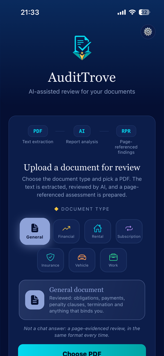
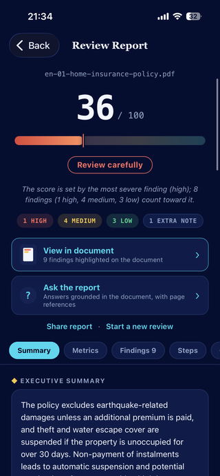
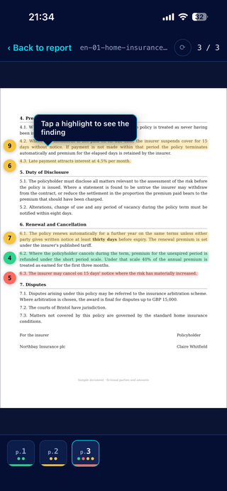
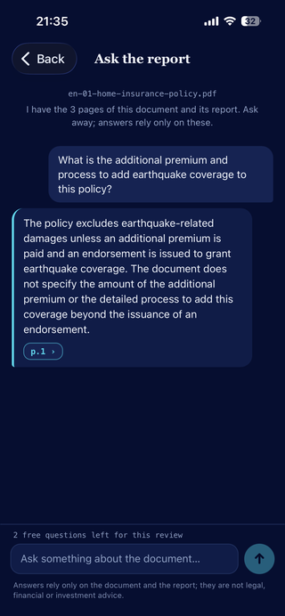

<p align="center">
  
</p>

<p align="center">
  
  
  
  
  
  <a href="https://audittrove.com"></a>
</p>

# AuditTrove Mobile

The iOS and Android client for [AuditTrove](https://github.com/mertkaracamm/AuditTrove). You hand it a contract, a lease, an insurance policy or a financial report, and it gives you back a review: a score, a summary, and findings you can tap to see highlighted on the page they came from.

One Expo codebase, both platforms, Turkish and English.

> AuditTrove supports your own preliminary decision. It does not determine lawfulness or regulatory compliance, and it does not replace professional financial, legal or investment advice.
>
> **Documents are not stored on the server.** A review runs on the text sent with that request. The copy you keep on your phone stays on your phone.

<p align="center">
  
  
  
  
</p>

## What it does

**Review a document.** Pick a PDF, scan pages with the camera, or choose photos from the gallery. Scanned pages are OCR'd on the device and assembled into a page-per-image PDF before upload, so the page numbers in the report still mean something.

**See the finding on the page.** Every finding carries a quotation and the position of that passage on the page. Tapping a finding opens the document at that page with the passage highlighted. This is the part that makes the review checkable instead of something you take on faith.

**Ask the report.** A follow-up question is answered from the findings that came back, with page references, not from a fresh pass over the document.

**Compare two versions.** Hand it the old and the new contract. Clauses are matched, every changed amount and wording is listed and marked as favorable or unfavorable.

**Keep your history.** Past reviews live in local storage on the device, along with the document copy. Clearing history deletes both.

## How it works

1. You pick a document type, then a PDF, a scan or photos.
2. Scans and photos are OCR'd on the device and turned into a PDF (`src/scan/scanner.js`).
3. The file goes to the backend as a background job (`POST /api/v1/audit/async`). The app polls for the result and registers a push token, so closing the app does not stop the review and a notification arrives when it is ready (`src/jobs/JobContext.js`).
4. The structured review is rendered and written to local history (`src/storage/history.js`).

Three models look at the document and a finding only enters the report when at least two of them agree on it. The scoring and the checklist live on the backend, which is why the same document gives the same score on a phone and in ChatGPT.

## Screens

| Screen | What it holds |
| --- | --- |
| `OnboardingScreen` | Three slides, shown once, including how review works and what is not kept |
| `HomeScreen` | Document type picker, upload, scan, gallery, active and recent reviews |
| `AnalyzingScreen` | Live progress while the job runs in the background |
| `ResultScreen` | Score, rationale, summary, findings by severity, metrics, actions, advisor questions, share |
| `DocumentViewerScreen` | The PDF with the finding highlighted on its page |
| `ChatScreen` | Follow-up questions about the finished review |
| `DiffScreen` | Clause by clause comparison of two versions |
| `HistoryScreen` | Past reviews, stored on the device |
| `SettingsScreen` | Language, replay onboarding, privacy policy, restore purchases |
| `PaywallScreen` | Monthly and yearly subscription with a free trial |

## Layout

```
src/
├── api/          Backend client, device registration, RevenueCat
├── components/   DocTypePicker, ScoreSeal
├── i18n/         Turkish and English strings
├── jobs/         Background job context and polling
├── scan/         On-device OCR and PDF assembly
├── screens/      The ten screens above
├── storage/      History, documents, usage counters, consent
└── utils/        Report formatting
```

## Running it

```bash
npm install
npx expo start
```

A development build is needed rather than Expo Go: the document scanner, PDF rendering and in-app purchases are native modules. Purchases sit behind a `PURCHASES_ENABLED` flag so the app still runs where RevenueCat is not configured.

```bash
eas build --profile production --platform all
eas submit --platform ios
```

`appVersionSource` is `remote` and the production profile auto-increments, so build numbers come from EAS rather than from `app.json`.

## Backend

The API lives in [mertkaracamm/AuditTrove](https://github.com/mertkaracamm/AuditTrove). `src/api/client.js` points at `https://audittrove.com`.
